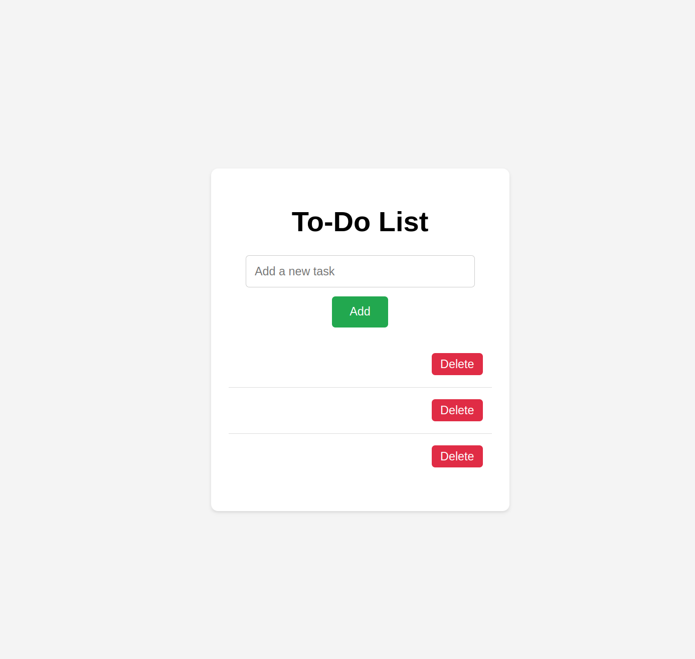

# To-Do-Web-App 📝
 

### A simple To-Do-List app made with JS and JAVA.

 

Features:
- [x] Add Task
- [x] Delete Task
- [x] Save todos to Local Storage when the state changes
- [x] Load the todos from Local Storage when the site is loaded again
   

